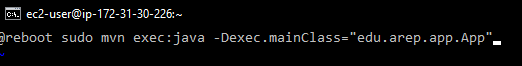
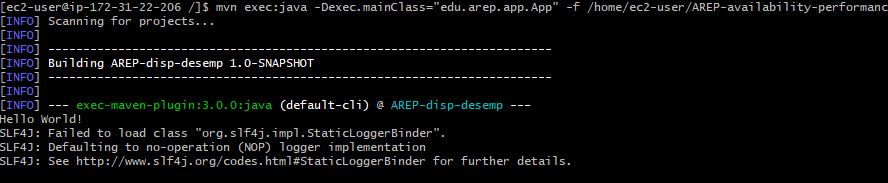
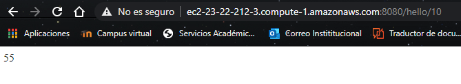
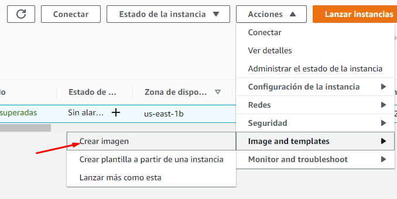
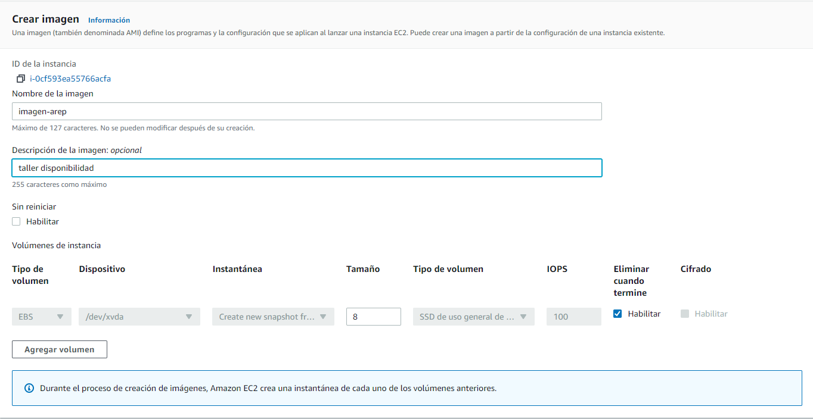
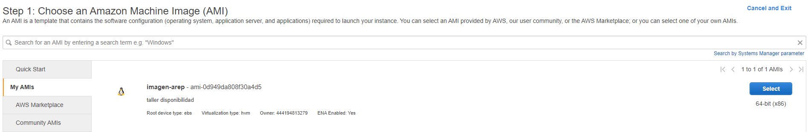
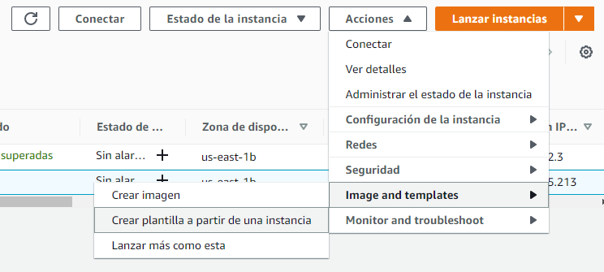
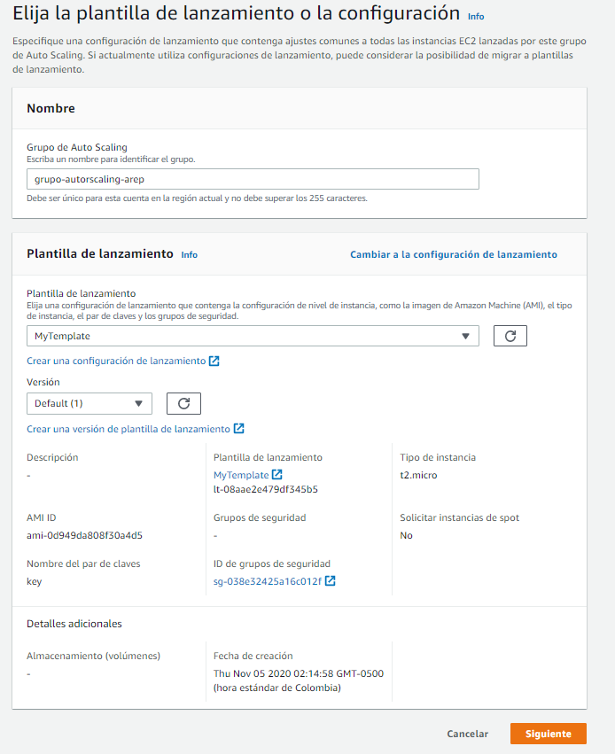
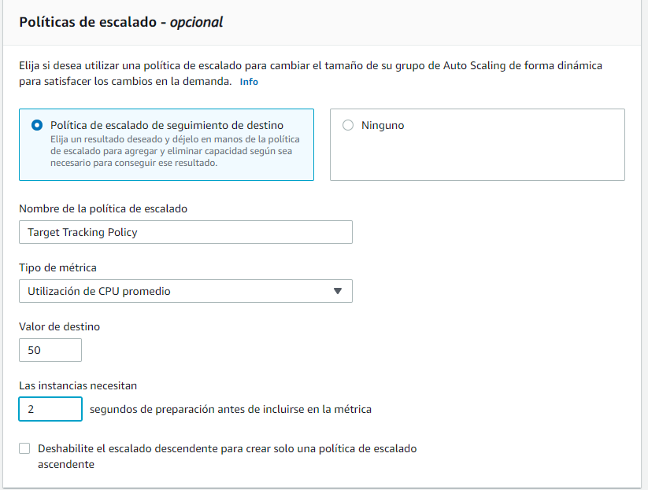

# Arep taller de disponibilidad y rendimiento
1. Idee un problema interesante que necesite una solución distribida y que necesite alto consumo de procesamiento, por ejemplo, ordenamiento de cadenas, indexación de grandes cantidades de texto, etc.. Genere los requerimientos mínimos.

La aplicacion consiste en el calculo de la secuencia de fibonacci al que corresponde un numero, los numeros pequeños consumen poco procesamiento, pero los numero mas grandes consumens bastente cpu por como esta construida la aplicación

* Una vez creada la maquina ec2, configuramos el crontab para ejecute la aplicación cada vez que se reinicia la maquina

* se comprueba que reiniciando la maquina la aplicación este corriendo

* creamos una imagen de la instancia

* luego creamos y configuramos una plantilla de lanzamiento

* por ultimo cremos un grupo de autoscaling con una politica por uso de cpu y las maximas instancias que se pueden generar

## Pruebas

* A continuación se puede ver que el consumo de la cpu es alto por lo que se crean las demas instancias que se pueden ver en el video.

[video de prueba](https://youtu.be/dUHzC8C6Apw)

## Autor

Edwin Yesid Rodriguez Maldonado

## Licencia

Este proyecto esta bajo la licencia Gnu