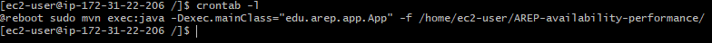

# Arep taller de disponibilidad y rendimiento
1. Idee un problema interesante que necesite una solución distribida y que necesite alto consumo de procesamiento, por ejemplo, ordenamiento de cadenas, indexación de grandes cantidades de texto, etc.. Genere los requerimientos mínimos.

La aplicacion consiste en el calculo de la secuencia de fibonacci al que corresponde un numero, los numeros pequeños consumen poco procesamiento, pero los numero mas grandes consumens bastente cpu por como esta construida la aplicación

* Una vez creada la maquina ec2, configuramos el crontab para ejecute la aplicación cada vez que se reinicia la maquina

* se comprueba que reiniciando la maquina la aplicación este corriendo

2. Construya un prototipo de la solución.
3. Depliegue la solución en AWS en EC2.
4. Configure la máquina para que inicie los servicios una vez se reinicia el servidor.
5. Cree un AMI a partir de esta máquina.
6. Despliegue la solución en un grupo de autoescalamiento.
7. Cargue la solución con muchas solicitudes para generar alta carga en el servidor.
8. Monitoree y verifique que se creen más instancias.
9. Documente el tutorial en GitHub con código, texto, e imágenes.